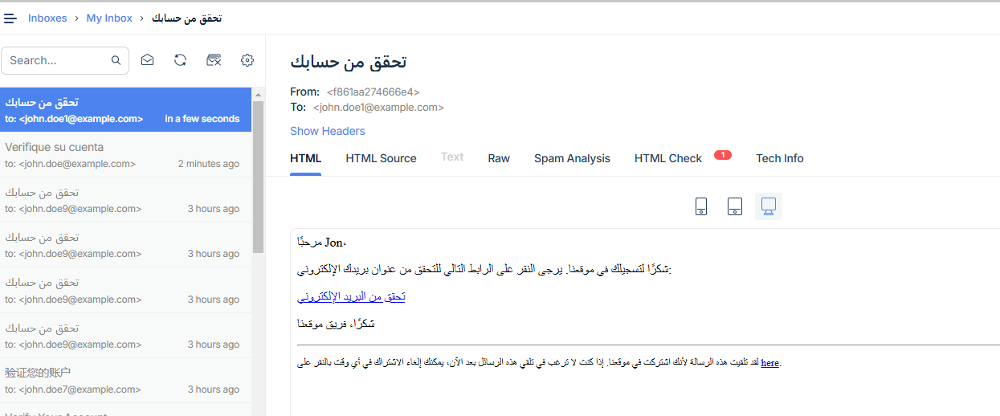
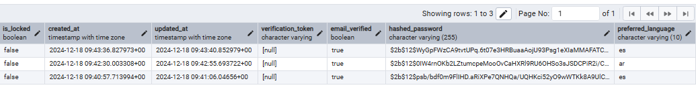
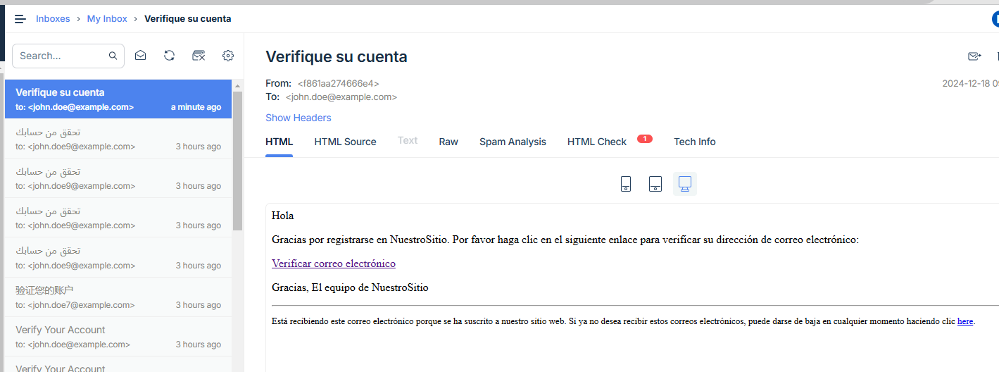

# Final Project - Reflection Document

First and foremost, I would like to say I have enjoyed your course tremendously throughout the semester. I believe that I have learned a lot from what is in the real world through this course. For example, the 12-Factor methodology where we took each one on a weekly basis as a challenge helping us look and understand the bigger picture. I would say the QR project was the best learning experience because it was able to bring a different task aside from just coding within VSCode.

## Feature: Localization Support
The feature I implemented is Localization Support (Feature 6). This feature allows applications to be easily translated into multiple languages. I decided to do this feature because I can relate it to the real world when I would translate certain applications or webpages for my grandparents to read in Spanish.

## Challenges Faced:
Ensuring proper libraries and code integration.
Troubleshooting issues such as:
Errors like "user not defined".
Email verification not working.
Mailtrap not receiving emails due to .env being ignored in dockerignore. After fixing that, email functionality worked as expected.
Overall, this project was a huge learning experience. I now feel more confident in my skills and tools for real-world projects.

## 5 QA Links:
Here are the 5 QA issues closed during the project:

1. [Issue 1: Fix Login API Failure](https://github.com/rl329/user_management/issues/1)
2. [Issue 2: Add Email Verification Process](https://github.com/rl329/user_management/issues/2)
3. [Issue 3: Improve Error Handling on Registration](https://github.com/rl329/user_management/issues/3)
4. [Issue 4: Add Test Coverage for User Service](https://github.com/rl329/user_management/issues/4)
5. [Issue 5: Resolve Duplicate Email Bug](https://github.com/rl329/user_management/issues/5)

## DockerHub Repository
- [DockerHub Repository](https://hub.docker.com/repository/docker/rl329/user_management)

## Test Files:
Below are the test file links (not the actual tests but references to the files):

1. **User Model Tests**
   - File: [test_user_model.py](https://github.com/rl329/user_management/blob/main/tests/test_user_model.py)

2. **User Service Tests**
   - File: [test_user_service.py](https://github.com/rl329/user_management/blob/main/tests/test_user_service.py)

3. **User Routes Tests**
   - File: [test_user_routes.py](https://github.com/rl329/user_management/blob/main/tests/test_user_routes.py)

4. **Email Service Tests**
   - File: [test_email_service.py](https://github.com/rl329/user_management/blob/main/tests/test_email_service.py)

5. **Utility Tests**
   - File: [test_utilities.py](https://github.com/rl329/user_management/blob/main/tests/test_utilities.py)

6. **JWT Service Tests**
   - File: [test_jwt_service.py](https://github.com/rl329/user_management/blob/main/tests/test_jwt_service.py)

7. **Database Integration Tests**
   - File: [test_database_integration.py](https://github.com/rl329/user_management/blob/main/tests/test_database_integration.py)

8. **Translation Function Tests**
   - File: [test_translation.py](https://github.com/rl329/user_management/blob/main/tests/test_translation.py)

9. **Email Verification Flow Tests**
   - File: [test_email_verification_flow.py](https://github.com/rl329/user_management/blob/main/tests/test_email_verification_flow.py)

10. **Login and Registration Tests**
    - File: [test_login_registration.py](https://github.com/rl329/user_management/blob/main/tests/test_login_registration.py)

## Project Screenshots

- **AR Verification**
  

- **AR Page**
  

- **PGAdmin View**
  

- **Spanish Registration**
  

- **Spanish Verification**
  

- **Spanish View**
  

## Conclusion:
This project has enhanced my understanding of real-world challenges, from implementing localization support to troubleshooting Docker, email, and testing issues. I now feel more prepared to apply these skills in future projects. Overall, the class was amazing and I have nothing but positive feedback thank you!
